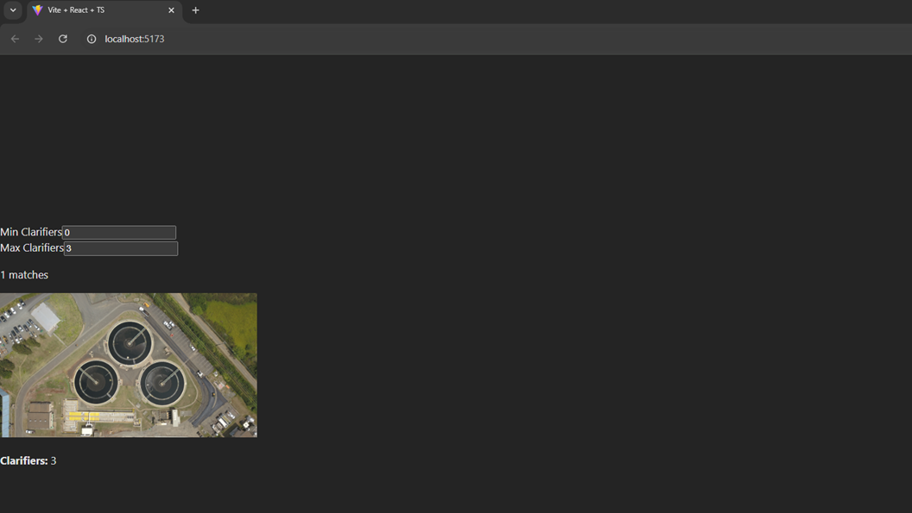

# 🌀 Clarifier Detection and Visualization App

This full-stack app detects circular clarifiers in satellite images of water treatment facilities using GPT-4o and displays them in a searchable, filterable web UI.

---

## 🧩 Project Structure

project-root/

├── clarifier-ui/ # React frontend

├── facility_images_azure/ # Satellite images (PNG/JPG)

├── clarifiers.db # SQLite database with detection results

├── main.py # FastAPI backend


---
## 🧩 Working UI Design


## ⚙️ Prerequisites

- Python 3.9+
- Node.js + npm
- OpenAI API key (GPT-4o access)
- Image files in `facility_images_azure/`

---

## 🧠 Step 1: Run Detection Script (Optional)

If you haven’t already populated `clarifiers.db`, use your detection script to do so:

```bash
python detect_clarifiers.py
This will:

Count clarifiers using GPT-4o vision

Save results (filename + count) in a SQLite database (clarifiers.db)

Make sure:

OPENAI_API_KEY is set in your .env file

facility_images_azure/ contains your image files
```

## 🧠  Step 2: Run the FastAPI Backend
```bash
Install dependencies:

pip install fastapi uvicorn python-dotenv

Then run the server:
uvicorn main:app --reload


Your API will be available at:
http://localhost:8000/clarifiers?min=0&max=10
http://localhost:8000/images/<filename>

The server reads from clarifiers.db and serves image files.
```

## 🖼️ Step 3: Set Up the React Frontend
```bash
cd clarifier-ui
npm install

npm run dev

Visit: http://localhost:5173

```

##  App Features
🔢 Filter by number of clarifiers using min/max inputs

📷 Display facility images with overlay count

🚀 Fast backend querying via SQLite

🧠 Smart clarifier detection via GPT-4o vision

